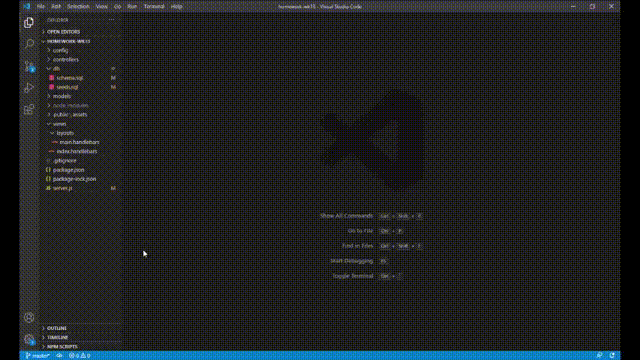

# Burger Logger

Burger logger made using MySQL, Node, Express, Handlebars and ORM; following the MVC design pattern
    
## Table of Contents
* [Installation](#installation)
* [Usage](#usage)
* [Licence](#licence)
* [Tests](#tests)
* [Questions](#questions)
    
    
## Installation:
    npm install
    
## Usage
node server.js
    
## Licence
This project is licensed under the terms of the MIT.

## Tests

https://infinite-shelf-22659.herokuapp.com/index
    
## Questions
GitHub: https://www.github.com/djtoohey/
    
Email: contact@declantoohey.com

